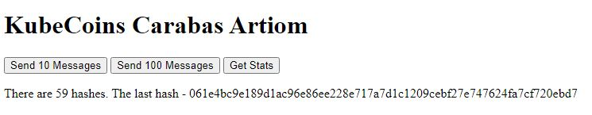

# Cloud Native Computing
# KubeCoins
## Carabas Artiom MOS 2

### Project Structure
- 2 Replicas of randomizer-carabasa
- 2 Replicas of hasher-carabasa
- 2 Replicas of worker-carabasa 
- 1 Replica of worker-carabasa-mongodb
- 1 Replica of frontend-carabasa

Simple frontend page with 3 buttons:

 

Available [here](https://kube.informatik.hs-furtwangen.de/frontend-carabasa/)

Grafana Dashboard [WEB](https://kube.informatik.hs-furtwangen.de/grafana/d/uTUcJjaGk/kubecoins-carabasa?orgId=1), [JSON](asset/grafana_dashboard.json)